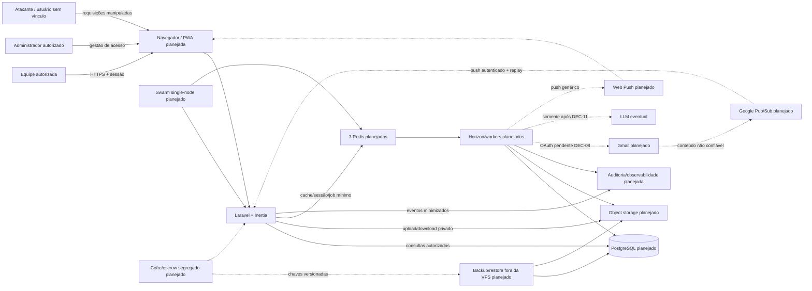

# Modelo de ameaças — Centro de Acolhimento

Escopo: aplicação Laravel/Inertia, banco, arquivos, PDFs, autenticação, agenda, relatórios e operação atuais, além das fronteiras **planejadas** de Redis/Horizon, Swarm, Gmail/OAuth/Pub/Sub, PWA/Web Push e eventual LLM. Revisar este documento em mudanças de arquitetura, fornecedor, permissão, dados ou integração.

## Estado do desenho

- **Implementado hoje na POC:** Laravel/Inertia, autenticação local incompleta, SQLite no deploy atual e arquivos locais/públicos. O cadastro público está **CONTROLADO por `SEG-01A` em 26/08/2026**, com rotas ausentes e PHPUnit/E2E aprovados; Fortify/TOTP/lifecycle, autorização ampla e ausência de auditoria permanecem riscos abertos em `SEG-01/02/03`.
- **Aprovado como alvo, ainda não implementado:** uma organização e uma unidade/local/complexo com várias casas internas; PostgreSQL; três Redis separados; Horizon; object storage privado; Contabo VPS com Swarm single-node; cofre/backup/restore; Fortify e MFA TOTP obrigatório para toda conta humana.
- **Pendente de decisão/gates e não autorizado para dados reais:** Gmail/OAuth/Pub/Sub, PWA/Web Push e LLM. Linhas tracejadas no diagrama representam essas fronteiras futuras.

Documentar um controle planejado não reduz o risco. Ele só passa a `CONTROLADO` após implementação, testes positivos/negativos, evidência operacional e aprovações exigidas.

## Ativos críticos

- identidade, família, processo judicial e localização de crianças/adolescentes;
- saúde, medicações, exames e saúde sexual/reprodutiva;
- fotos, anexos, os cinco tipos documentais aprovados, PDFs e assinaturas;
- credenciais, sessões, permissões e trilha de auditoria;
- segredos TOTP, recovery codes, tokens OAuth, subscriptions Web Push e chaves de criptografia/backup;
- integridade do histórico, numeração documental e indicadores oficiais;
- alocação/localização dentro das casas, mensagens institucionais e propostas de prazo sob revisão;
- disponibilidade operacional, backups e capacidade de recuperação.

## Atores e fronteiras de confiança

Cada seta cruza uma fronteira: navegador/service worker é não confiável; autorização é decidida no backend; banco, storage, Redis, filas, logs e integrações usam identidades/segredos separados por ambiente. Uma implantação contém uma organização e uma unidade; as várias casas são localizações internas e nunca contexto/tenant escolhível pelo cliente. Swarm single-node não oferece alta disponibilidade. Suporte, dashboard Horizon, backup e cofre não recebem acesso irrestrito por padrão.

## Principais ameaças e controles

| ID | Cenário | Impacto | Controles e evidência exigida |
|---|---|---|---|
| T01 | IDOR ao trocar ID de criança, atendimento, anexo ou PDF | Exposição grave de menor | Policies por ação, query scoping por unidade/vínculo/sensibilidade, testes negativos por rota |
| T02 | Conta pública, sem TOTP, inativa, recaller indevido ou sessão não revogada | Acesso não autorizado | Cadastro público CONTROLADO por `SEG-01A` em 26/08/2026, com regressão obrigatória de GET/POST; Fortify + TOTP obrigatório para toda conta humana permanece aberto em `SEG-01`, assim como estados `pendente_mfa`/`password_only` fail-closed, ausência de passkey/remember-me, rate limit, step-up, inativação/revogação e auditoria de login/MFA |
| T03 | Upload disfarçado, SVG/HTML ativo, bomba de imagem/PDF ou malware | RCE indireta, leitura local, DoS | Storage privado, assinatura/MIME real, limites, EXIF, quarentena, antimalware, render isolado |
| T04 | URL pública/permanente ou artefato de CI contém foto/documento | Vazamento em massa | Download via Policy/URL curta, auditoria, artifacts sintéticos e retenção curta |
| T05 | Mass assignment ou validação apenas na UI altera unidade, autor, status ou permissão | Fraude e quebra de isolamento | FormRequest, campos permitidos explícitos, valores sensíveis derivados do servidor, testes de payload extra |
| T06 | Corrida em status, medicação, numeração documental ou fechamento | Histórico/relatório incorreto | Transação, constraint, lock/versão otimista e teste concorrente PostgreSQL |
| T07 | Edição/exclusão apaga fatos ou documento final | Perda de evidência | Eventos/versões append-only, hash/snapshot, retificação ligada, auditoria protegida |
| T08 | Logs, erros, analytics ou prompts copiam PII/saúde/tokens | Vazamento secundário | Redação, allowlist de campos, debug desligado, testes/inspeção de logs e dados sintéticos |
| T09 | XSS em narrativas ou conteúdo de documento | Roubo de sessão/ação indevida | Escape por padrão, sanitização quando HTML for inevitável, CSP, teste de payload armazenado |
| T10 | CSRF, brute force, enumeração e abuso de exportação/PDF | Ação indevida/DoS | CSRF, rate limits por ação, filas, limites, respostas não enumeráveis e alertas |
| T11 | Deploy executa reset/seed ou filesystem efêmero perde banco/arquivo | Perda total/divergência | PostgreSQL e storage duráveis, migrations incrementais, ambientes separados, restore testado |
| T12 | Backup, fornecedor ou suporte amplia acesso/transferência | Exposição fora do app | Criptografia, menor privilégio, DPA/suboperadores/região, logging, retenção e plano de saída |
| T13 | Cliente adultera organização/unidade ou casa é tratada como tenant/permissão | Escopo inconsistente e exposição entre casos | Contexto único resolvido no backend, requests não atribuem organização/unidade; casa é localização interna; `DEC-01` decide histórico; Policies continuam por papel/setor/vínculo/sensibilidade |
| T14 | Token OAuth Gmail excessivo, vazado, não revogável ou vinculado à identidade coletiva | Leitura indevida da caixa institucional | `DEC-08`, menor escopo, principal da aplicação separado, credencial criptografada/rotacionável, revogação/blast radius, Limited Use e PoC sintética antes de dados reais |
| T15 | Push Pub/Sub forjado, repetido, perdido ou histórico Gmail expirado | Evento duplicado, omitido ou conteúdo falso | Autenticar origem/assinatura conforme rota aprovada, chave de idempotência, checkpoint, reconciliação `history.list`, bootstrap/full sync e nenhum efeito jurídico automático |
| T16 | E-mail malicioso induz ação, URL/tool call ou falsa extração de prazo | Fraude, exfiltração e compromisso jurídico incorreto | Entrada não confiável, parsing isolado, allowlist de operações, sem execução/chamada externa, proposta sem efeito e revisão humana conforme `DEC-09/11` |
| T17 | Service worker/cache/offline/bfcache preserva dados após logout ou troca de usuário | Exposição no dispositivo compartilhado/perdido | PWA começa network-only, não cacheia respostas autenticadas/PII; limpeza/revalidação em logout/inativação/troca; testes de Cache Storage, IndexedDB, storage e bfcache |
| T18 | Push revela nome, processo, diagnóstico/prazo sensível ou chega a aparelho revogado | Vazamento na tela bloqueada | Opt-in, payload genérico sem PII, detalhe apenas após login/Policy, inventário/revogação por dispositivo, revalidação do job e tratamento 404/410 |
| T19 | Redis/Horizon expõe sessão, payload, failed job ou permite replay após restore | Sequestro de sessão e vazamento secundário | Três Redis isolados; IDs opacos; payload mínimo; trim/redação; `/horizon` por Gate/rede; outbox; restore invalida/revalida sessões e retries |
| T20 | Swarm/cofre/backup compartilha segredo/domínio de falha ou restore não recupera chaves | Perda total, indisponibilidade ou acesso indevido | Secrets por ambiente, cofre/escrow segregado e versionado, unlock key separada, backup fora da VPS, roles mínimas, restore integral e RPO/RTO testados |
| T21 | LLM recebe dados Gmail/assistenciais, retém/treina ou obedece prompt injection | Transferência indevida, exfiltração e decisão incorreta | LLM bloqueado para dados reais até `DEC-11`, RIPD/DPA/no-training/região/retenção/saída, corpus sintético, minimização e revisão humana obrigatória |
| T22 | Administradora se promove a `equipe_tecnica`, delega papel fora da allowlist ou usa sessão sem step-up | Elevação de privilégio e acesso assistencial indevido | Alvo obrigatoriamente terceiro, Policy backend, allowlist fechada, step-up senha + TOTP de no máximo 5 minutos, alerta/auditoria, bootstrap inicial fora do fluxo comum e testes negativos |

## Abuse cases obrigatórios para QA

1. Usuário autenticado acessa URL/ID de outro setor ou unidade.
2. Usuário comum envia `role`, `unidade_id`, `created_by`, status final ou campos sensíveis extras.
3. Atacante envia arquivo com extensão permitida e conteúdo diferente, imagem com dimensões enormes e SVG com referência local.
4. Dois requests simultâneos criam o mesmo número, encerram a mesma medicação ou fazem transições conflitantes.
5. Documento final é alterado após mudança do cadastro ou por update direto.
6. Exportação/relatório revela nomes quando somente agregado é necessário.
7. Erro de geração de PDF ou job registra narrativa, token, caminho local ou URL assinada.
8. Conta inativada mantém sessão, download ou link assinado utilizável além do prazo.
9. Visitante usa GET/POST `/register`; conta `password_only`, sem TOTP ou com recaller tenta acessar recurso, QR, recovery, re-enrollment ou administração.
10. Cliente envia `organizacao_id`, `unidade_id` ou uma casa interna adulterada para ampliar escopo; mudança de casa sobrescreve histórico antes de `DEC-01`.
11. Pub/Sub falso/repetido/perdido e `historyId` expirado são reconciliados sem duplicar proposta; remetente/label não vira autorização.
12. E-mail sintético contém prompt injection, URL e instrução de ferramenta; nada é executado nem vira prazo/agenda sem revisão humana.
13. Após logout, inativação e troca de usuário, dados autenticados não permanecem acessíveis por service worker, Cache Storage, cache HTTP, bfcache, IndexedDB ou storage do navegador.
14. Push para aparelho perdido/revogado ou subscription 404/410 não é reenviado; payload e lockscreen não contêm PII.
15. Usuário comum e `password_only` não acessam `/horizon`; jobs, failed jobs, métricas e logs não contêm e-mail, narrativa, token ou documento.
16. Restore integral recupera PostgreSQL/objetos/chaves dentro do RPO/RTO sem reativar sessão/recaller revogado; ausência do cofre ou backup fora da VPS falha o gate.
17. Eventual LLM permanece desligado para dados reais e corpus sintético adversarial não aciona ferramenta, URL, persistência ou efeito jurídico.
18. Administradora tenta atribuir `equipe_tecnica` a si mesma, delegar papel fora da allowlist ou usar sessão sem step-up recente; todas as tentativas falham sem mudança parcial e geram alerta/auditoria minimizados.

## Riscos de go-live ainda abertos

Os bloqueadores P0 de `TODO.md` permanecem: SQLite efêmero, arquivos públicos, autorização ampla, ausência de auditoria, deploy destrutivo, retenção/RIPD e recuperação não aprovadas. O cadastro público foi CONTROLADO por `SEG-01A` em 26/08/2026, mas Fortify/TOTP/lifecycle continuam abertos em `SEG-01`. PostgreSQL, Redis/Horizon, Swarm/cofre/restore e storage privado são alvo, não evidência atual. Gmail/PWA/LLM continuam bloqueados para dados reais pelos seus gates. Este modelo não declara a POC segura para dados reais.

| Risco em 26/08/2026 | Estado | Evidência atual | Responsável/tarefa |
|---|---|---|---|
| Cadastro público | `CONTROLADO em 26/08/2026` | `SEG-01A`: rotas GET/POST ausentes; PHPUnit de registro/autenticação 6/6 (14 assertivas) e E2E desktop/mobile 6/6; abuse case GET/POST permanece regressivo | Engenharia / `SEG-01A`; controles restantes de identidade em `SEG-01` |
| TOTP obrigatório/lifecycle de sessão | `PLANEJADO — BLOCKER` | `DEC-07` aprovado, Fortify/TOTP/step-up/revogação ainda não implementados | Engenharia / `SEG-01`, `IAM-02` |
| Deploy destrutivo/SQLite efêmero | `ABERTO — BLOCKER` | script `vercel` ainda contém `migrate:fresh --seed` | Engenharia / `ARQ-01`, `ARQ-03` |
| Arquivos/fotos públicos | `ABERTO — BLOCKER` | storage atual não garante autorização por download | Engenharia / `ARQ-02`, `SEG-05` |
| Autorização e auditoria granulares | `ABERTO — BLOCKER` | matriz/policies/trilha ainda incompletas | Produto + Engenharia / `SEG-02`, `SEG-03` |
| Redis/Horizon/Swarm/cofre/restore | `PLANEJADO — BLOCKER` | arquitetura aprovada, serviços e restore integral ainda sem evidência | Engenharia / `ARQ-03/04/07`, `OPS-01/02` |
| Contexto único e casas internas | `DECIDIDO PARCIALMENTE` | organização/unidade únicas aprovadas; regra de histórico entre casas pendente em `DEC-01`; nada implementado | Produto + Engenharia / `DEC-01/05`, `ACO-01`, `SEG-02` |
| Gmail/OAuth/Pub/Sub | `BLOQUEADO PARA DADOS REAIS` | tipo de conta/principal/escopo/rota ainda dependem de `DEC-08` e PoC sintética | Produto + Engenharia / `DEC-08/09`, `EML-01/02/03` |
| PWA/Web Push | `BLOQUEADO PARA DADOS REAIS` | política, network-only, dispositivos e revogação pendentes | Produto + Engenharia / `DEC-10`, `PWA-01/02` |
| LLM | `NÃO APROVADO` | `DEC-11`, RIPD, fornecedor e avaliação sintética pendentes | Produto + Jurídico + Engenharia / `DEC-11`, `LGPD-02`, `EML-04` |

Um teste criado não muda o estado do risco. O estado só avança para `CONTROLADO` após implementação, evidência positiva/negativa e revisão Senior + QA; risco aceito exige responsável, prazo e aprovação humana.

## Critério de revisão

O Senior atualiza ameaças/controles em toda mudança de trust boundary. O QA liga cada controle a teste ou evidência operacional. Risco residual `BLOCKER/HIGH` impede entrega; aceites humanos e riscos `MEDIUM` devem ter responsável e tarefa registrada.
