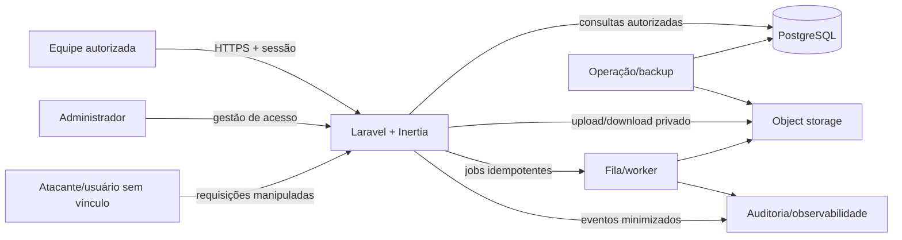

# Modelo de ameaças — Centro de Acolhimento

Escopo: aplicação Laravel/Inertia, banco, arquivos, PDFs, autenticação, agenda, relatórios e operação. Revisar este documento em mudanças de arquitetura, fornecedor, permissão, dados ou integração.

## Ativos críticos

- identidade, família, processo judicial e localização de crianças/adolescentes;
- saúde, medicações, exames e saúde sexual/reprodutiva;
- fotos, anexos, PIAs, ofícios, relatórios e assinaturas;
- credenciais, sessões, permissões e trilha de auditoria;
- integridade do histórico, números de ofício e indicadores oficiais;
- disponibilidade operacional, backups e capacidade de recuperação.

## Atores e fronteiras de confiança

Cada seta cruza uma fronteira: navegador é não confiável; autorização é decidida no backend; banco/storage/fila/logs usam identidades e segredos separados por ambiente; suporte e backup não recebem acesso irrestrito por padrão.

## Principais ameaças e controles

| ID | Cenário | Impacto | Controles e evidência exigida |
|---|---|---|---|
| T01 | IDOR ao trocar ID de criança, atendimento, anexo ou PDF | Exposição grave de menor | Policies por ação, query scoping por unidade/vínculo/sensibilidade, testes negativos por rota |
| T02 | Conta pública, fraca, inativa ou sessão não revogada | Acesso não autorizado | Fechar registro, MFA privilegiado, rate limit, inativação/revogação e auditoria de login |
| T03 | Upload disfarçado, SVG/HTML ativo, bomba de imagem/PDF ou malware | RCE indireta, leitura local, DoS | Storage privado, assinatura/MIME real, limites, EXIF, quarentena, antimalware, render isolado |
| T04 | URL pública/permanente ou artefato de CI contém foto/documento | Vazamento em massa | Download via Policy/URL curta, auditoria, artifacts sintéticos e retenção curta |
| T05 | Mass assignment ou validação apenas na UI altera unidade, autor, status ou permissão | Fraude e quebra de isolamento | FormRequest, campos permitidos explícitos, valores sensíveis derivados do servidor, testes de payload extra |
| T06 | Corrida em status, medicação, número de ofício ou fechamento | Histórico/relatório incorreto | Transação, constraint, lock/versão otimista e teste concorrente PostgreSQL |
| T07 | Edição/exclusão apaga fatos ou documento final | Perda de evidência | Eventos/versões append-only, hash/snapshot, retificação ligada, auditoria protegida |
| T08 | Logs, erros, analytics ou prompts copiam PII/saúde/tokens | Vazamento secundário | Redação, allowlist de campos, debug desligado, testes/inspeção de logs e dados sintéticos |
| T09 | XSS em narrativas ou conteúdo de documento | Roubo de sessão/ação indevida | Escape por padrão, sanitização quando HTML for inevitável, CSP, teste de payload armazenado |
| T10 | CSRF, brute force, enumeração e abuso de exportação/PDF | Ação indevida/DoS | CSRF, rate limits por ação, filas, limites, respostas não enumeráveis e alertas |
| T11 | Deploy executa reset/seed ou filesystem efêmero perde banco/arquivo | Perda total/divergência | PostgreSQL e storage duráveis, migrations incrementais, ambientes separados, restore testado |
| T12 | Backup, fornecedor ou suporte amplia acesso/transferência | Exposição fora do app | Criptografia, menor privilégio, DPA/suboperadores/região, logging, retenção e plano de saída |

## Abuse cases obrigatórios para QA

1. Usuário autenticado acessa URL/ID de outro setor ou unidade.
2. Usuário comum envia `role`, `unidade_id`, `created_by`, status final ou campos sensíveis extras.
3. Atacante envia arquivo com extensão permitida e conteúdo diferente, imagem com dimensões enormes e SVG com referência local.
4. Dois requests simultâneos criam o mesmo número, encerram a mesma medicação ou fazem transições conflitantes.
5. Documento final é alterado após mudança do cadastro ou por update direto.
6. Exportação/relatório revela nomes quando somente agregado é necessário.
7. Erro de geração de PDF ou job registra narrativa, token, caminho local ou URL assinada.
8. Conta inativada mantém sessão, download ou link assinado utilizável além do prazo.

## Riscos de go-live ainda abertos

Os bloqueadores P0 de `TODO.md` permanecem: SQLite efêmero, arquivos públicos, cadastro público, autorização ampla, ausência de auditoria, deploy destrutivo, retenção/RIPD e recuperação não aprovadas. Este modelo orienta implementação e testes; ele não declara a POC segura para dados reais.

| Risco em 31/07/2026 | Estado | Evidência atual | Responsável/tarefa |
|---|---|---|---|
| Cadastro público | `ABERTO — BLOCKER` | rotas GET/POST ainda ativas; novo E2E negativo deve falhar até `SEG-01` | Produto + Engenharia / `SEG-01` |
| Deploy destrutivo/SQLite efêmero | `ABERTO — BLOCKER` | script `vercel` ainda contém `migrate:fresh --seed` | Engenharia / `ARQ-01`, `ARQ-03` |
| Arquivos/fotos públicos | `ABERTO — BLOCKER` | storage atual não garante autorização por download | Engenharia / `ARQ-02`, `SEG-05` |
| Autorização e auditoria granulares | `ABERTO — BLOCKER` | matriz/policies/trilha ainda incompletas | Produto + Engenharia / `SEG-02`, `SEG-03` |

Um teste criado não muda o estado do risco. O estado só avança para `CONTROLADO` após implementação, evidência positiva/negativa e revisão Senior + QA; risco aceito exige responsável, prazo e aprovação humana.

## Critério de revisão

O Senior atualiza ameaças/controles em toda mudança de trust boundary. O QA liga cada controle a teste ou evidência operacional. Risco residual `BLOCKER/HIGH` impede entrega; aceites humanos e riscos `MEDIUM` devem ter responsável e tarefa registrada.
