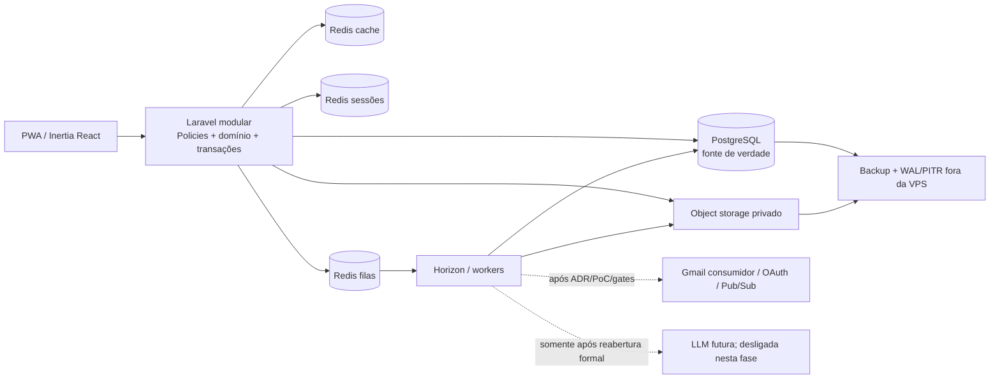
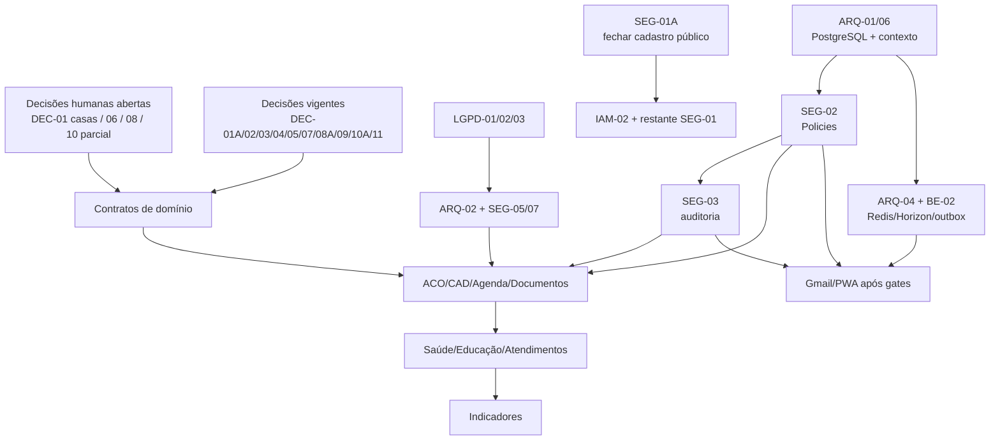

# Blueprint do projeto — Centro de Acolhimento

- Status: consolidado para orientar a execução; não declara implementação pronta
- Atualizado em: 16/09/2026
- Fonte de verdade do backlog: [`TODO.md`](../../TODO.md)
- Arquitetura detalhada: [arquitetura-alvo](target-architecture.md)
- Decisões: [ADRs](../adr/)
- Riscos de segurança: [modelo de ameaças](../../SECURITY_THREAT_MODEL.md)

Este blueprint responde, em uma única visão, se o projeto já possui **arquitetura, módulos, dependências, riscos, roadmap e primeiras tarefas executáveis**. Ele não duplica critérios completos nem muda o estado das tarefas; conflitos são resolvidos por `TODO.md`, ADRs, `RTK.md` e `AGENTS.md`, nessa ordem de especialidade.

## 1. Contexto institucional e limites do produto

A aplicação atende uma organização de acolhimento institucional — também descrita pelo solicitante como “orfanato” — com uma única unidade/local/complexo físico. Dentro do complexo existem várias casas destinadas à moradia e ao cuidado cotidiano de crianças e adolescentes.

As casas são localizações internas da unidade única, não organizações, unidades operacionais ou tenants. A organização conta com equipe de cuidado cotidiano, equipe técnica e pessoal jurídico/administrativo. Na fase inicial, somente `equipe_tecnica` e `administradora` possuem contas; ambas compartilham o mesmo acesso funcional assistencial aprovado e a agenda, sem informação assistencial privada entre elas. Somente a administradora gerencia contas/acessos e consulta a auditoria funcional minimizada em modo somente leitura. Técnicas veem autoria/data e histórico funcional autorizado na ficha/linha do tempo, mas não administram usuários, auditoria operacional, segredos ou infraestrutura; nem técnicas nem administradora editam/apagam histórico, auditoria ou controles de segurança. `SEG-02/03` continuam pendentes até Policies/Gates, trilha append-only e testes negativos. Profissões, atribuições legais e acessos de cuidadoras, jurídico, visitantes e integrações não são inferidos.

A instituição precisa produzir e rastrear exatamente cinco documentos funcionais nesta fase: PIA, Relatório de visita técnica, Parecer do acolhido, Ficha de ingresso e Termo de Recebimento/Entrega de documentos e pertences pessoais. O Parecer relata a situação e formula pedido ao juiz. O PDF final apenas identifica de um a quatro profissionais selecionados por nome, cargo/função e conselho + registro quando aplicável; a fase atual não implementa assinatura eletrônica/digital nem declara validade jurídica. O produto apoia esse trabalho e seus prazos, mas não determina automaticamente prazo/efeito jurídico, não envia compromisso sem revisão humana e não substitui conferência profissional.

`DEC-01A` definiu que evasão e internação ocorrem durante episódio aberto: evadido é quem fugiu/está desaparecido e internado é quem está temporariamente hospitalizado por saúde. Nenhum desses estados encerra/substitui o episódio; retorno cria nova movimentação append-only. A parte ainda aberta de `DEC-01` decide se alocação e transferência entre casas exigem período, motivo, ator e histórico. Até essa decisão, “casa atual” não deve ser introduzida como campo sobrescrevível nem ser confundida com unidade.

## 2. Arquitetura consolidada

O alvo aprovado é um **monólito modular Laravel 13 + Inertia 2 + React 18**, preservando transações e autorização no backend. PostgreSQL é a fonte de verdade; Redis terá processos/volumes separados para cache, sessões e filas; Laravel Queues + Horizon executará jobs idempotentes. Fotos e documentos irão para object storage privado externo. A implantação futura será Docker Swarm single-node em Contabo VPS, sem alegar alta disponibilidade. O perfil 4 vCPU/8 GB/100 GB SSD permanece candidato sujeito a capacidade, alertas, RPO/RTO e restore em `ARQ-07`; contratar o auto backup pago do provedor junto à VPS foi aprovado em 16/09/2026 como camada adicional, ainda não ativa nem validada. PostgreSQL em container separado da aplicação na mesma VPS oferece isolamento lógico, não outro domínio de falha.

Backups PostgreSQL base + WAL/PITR e de objetos devem ficar criptografados fora da VPS, com credenciais/chaves segregadas e restore testado. Auto backup/snapshot do provedor ou cópia local nunca é a única cópia. A intenção de manter backup local por cinco anos não aprova retenção: prazo por categoria depende de `LGPD-03` e controlador/jurídico; eventual cópia exige criptografia, acesso mínimo, inventário e descarte verificável.

Invariantes transversais:

- autorização e escopo no servidor; o frontend nunca decide acesso;
- uma organização e uma unidade por implantação, resolvidas pelo backend;
- fatos assistenciais, movimentações, documentos finalizados e auditoria append-only;
- mutação e auditoria/outbox confirmadas atomicamente;
- arquivos privados, nomes opacos sem PII, quarentena e download autorizado/auditado;
- UTC no banco e apresentação em `America/Sao_Paulo`;
- migrations aditivas e roll-forward; nunca `migrate:fresh` em staging/produção;
- dados exclusivamente sintéticos até todos os gates P0 e go-live formal.

## 3. Módulos e fronteiras

| Módulo | Responsabilidade | Depende principalmente de |
|---|---|---|
| Identidade e acesso | contas individuais, Fortify, TOTP, lifecycle, sessão e recuperação | `DEC-07`, `SEG-01/02/03/04`, `IAM-02` |
| Contexto institucional | organização/unidade únicas, setores, papéis e casas internas quando aprovadas | `DEC-01/05`, `SEG-02`, `ARQ-06` |
| Pessoa e ficha única | identificação, família, documentos e prevenção de duplicidade | `DEC-06`, `CAD-01/02`, `LGPD-01/03` |
| Acolhimento | episódios, situação operacional e movimentações append-only | `DEC-01`, `ACO-01/02/03` |
| Saúde | atendimentos, encaminhamentos, exames e medicações versionadas | `SAU-01` a `SAU-05`, `SEG-02/03` |
| Educação | vínculo escolar temporal, contatos e tarefas | `EDU-01/02/03`, `SEG-02/03` |
| Atendimentos e encaminhamentos | ocorrências estruturadas, prazos e desfechos | `DEC-03`, `ATE-01/02` |
| Agenda | criador, responsável, participantes, visibilidade e lembretes | `DEC-02`, `AGD-01/02` |
| Documentos | cinco tipos aprovados, destinatário judicial do Parecer, identificação profissional, snapshots, numeração e PDFs sem assinatura eletrônica/digital | `DEC-04/06`, `DOC-01` a `DOC-06` |
| Arquivos privados | upload, quarentena, antimalware, storage e download auditado | `ARQ-02`, `SEG-05/07`, `LGPD-01/03` |
| Indicadores | taxonomia, agregados, drill-down autorizado e fechamento anual | `DEC-03`, `BI-01/02/03` |
| Gmail e prazos | ingestão mínima, reconciliação e propostas sob revisão humana | `DEC-08/09/11`, `EML-01` a `EML-05` |
| PWA e notificações | instalação, dispositivos, opt-in, push genérico e fallback in-app | `DEC-10`, `PWA-01/02` |
| Auditoria e LGPD | trilha append-only, finalidade, retenção, incidentes e direitos | `SEG-03`, `LGPD-01` a `LGPD-05` |
| Operação | PostgreSQL, Redis, filas, deploy, backup, restore e observabilidade | `ARQ-01` a `ARQ-08`, `OPS-01/02/03` |

Controllers permanecem finos; Form Requests validam entrada; Policies/Gates autorizam por recurso e ação; Actions/Services concentram caso de uso transacional; constraints PostgreSQL protegem invariantes. Integrações não escrevem fatos jurídicos/assistenciais diretamente: geram proposta, outbox ou estado pendente para revisão/reconciliação.

## 4. Dependências e sequência de habilitação

Dependências externas permitidas ou pendentes:

| Tecnologia/serviço | Estado | Regra de adoção |
|---|---|---|
| Laravel/Inertia/React/PostgreSQL | aprovados | preferir recursos nativos e padrões existentes |
| Fortify/TOTP | aprovado, não implementado | sem passkey; extensão de recovery codes precisa testes transacionais |
| Redis + Horizon | aprovados, não implementados | três serviços/volumes; sem Redis Cluster com Horizon |
| Object storage | obrigatório, fornecedor pendente | privado, criptografado, saída/backup e DPA avaliados |
| Gmail/Google OAuth/Pub/Sub | tipo consumer confirmado; integração pendente | OAuth web consentido/offline, menor escopo, PoC sintética, Limited Use, titularidade, revogação/retenção; sem senha, service account ou domain-wide delegation |
| Web Push | política mínima decidida; implementação pendente | opt-in contextual, nunca no primeiro carregamento, payload genérico sem PII e detalhes só após autenticação; lembrete padrão no dia civil anterior às 09:00; plataformas, quiet hours, fallback/revogação ainda abertos |
| LLM/Groq | desligado na fase atual | somente após reabertura formal, RIPD, fornecedor/no-training/Limited Use, corpus sintético e revisão humana; Groq não é fornecedor decidido |
| Nova biblioteca | não autorizada por padrão | avaliação do Senior conforme `RTK.md`, com benefício e plano de saída |

## 5. Riscos e gates

O detalhamento técnico está no [modelo de ameaças](../../SECURITY_THREAT_MODEL.md). Os riscos abaixo governam a ordem de execução.

| Risco | Severidade/status | Gate para controle |
|---|---|---|
| Cadastro público GET/POST | CONTROLADO por `SEG-01A` em 26/08/2026 | rotas ausentes; PHPUnit 6/6 (14 assertivas) e E2E desktop/mobile 6/6; manter regressão GET/POST; `SEG-01` segue aberto para Fortify/TOTP/lifecycle |
| SQLite efêmero e deploy com reset/seed | Controlado em local/CI por `ARQ-01A`; produção bloqueada | `ARQ-01/03/07`, PostgreSQL produtivo, migrations roll-forward e restore |
| Fotos/documentos públicos | BLOCKER aberto | `ARQ-02`, `SEG-05/07`, Policy e download privado testado |
| Acesso amplo sem Policies/auditoria | BLOCKER aberto | `SEG-02/03`, teste IDOR/negação e trilha minimizada |
| Exclusão/cascata e histórico mutável | HIGH aberto | constraints, eventos/versões append-only e retenção aprovada |
| Numeração `MAX + 1` | HIGH aberto | `DOC-05`, sequência transacional e concorrência PostgreSQL |
| Conteúdo possivelmente real em `docs/formatacoes` | BLOCKER preventivo | não abrir/processar/versionar; procedimento humano de inventário, quarentena/sanitização e descarte em `LGPD-01/02/03` |
| VPS única | risco ainda não aceito | perfil candidato 4 vCPU/8 GB/100 GB SSD e contratação do auto backup aprovados; `ARQ-07` ainda exige capacidade, escopo do serviço, backup externo independente, restore e RPO/RTO aprovados |
| Gmail como entrada não confiável | bloqueado para dados reais | `DEC-08/09`, OAuth/PoC/Limited Use, extração literal determinística e revisão humana; nenhuma agenda/lembrete antes da aprovação e toda correção posterior é revisionada/auditada |
| LLM | fora da fase atual | `DEC-11`; eventual reabertura exige RIPD, fornecedor/no-training/Limited Use, corpus sintético e ausência de autonomia |

Nenhum teste criado altera sozinho o estado do risco. `BLOCKER/HIGH`, teste obrigatório falhando, possível vazamento ou restore não comprovado impedem dados reais e entrega.

## 6. Roadmap por marcos

1. **Publicar a fundação atual:** consolidar `ARQ-01B/ARQ-06A` já validada, sem acoplar novo domínio; `ARQ-01C` aguarda rollout/reconciliação no ambiente-alvo.
2. **Base segura sintética:** `SEG-02/03` + corte mínimo de `BE-02`, depois `IAM-02/SEG-01`, storage privado `ARQ-02/SEG-05` e filas/operação `ARQ-04/03` + `OPS`.
3. **Núcleo operacional:** `ACO-01/02/03`, cadastro/ficha/busca/agenda e os cinco documentos, sempre com Policies e auditoria já ativas.
4. **Registros e indicadores:** atendimentos, Saúde, Educação e relatórios com a taxonomia aprovada em `DEC-03`.
5. **Gmail e PWA por último:** somente após os gates, ingestão/reconciliação, propostas revisionadas, instalação, dispositivos e lembretes conforme `DEC-09/10`.

Antes de qualquer dado real permanecem obrigatórios `LGPD-01/02/03`, `SEG-04/05/06/07`, TLS/roles/segredos, fornecedor e backup externo, validação do auto backup contratado, SLO/RPO/RTO, capacidade, restore integral e go-live formal.

A lista completa e os estados estão em [Ordem recomendada de execução](../../TODO.md#9-ordem-recomendada-de-execução). Uma etapa posterior não contorna dependências ou gates de uma anterior.

## 7. Primeiras tarefas executáveis

### Convenção de execução

- **T1 — documental neutro:** somente leitura ou texto que não altera contrato, operação, segurança nem regra de domínio; pode dispensar o trio apenas na exceção exata de `AGENTS.md`.
- **T3 — fluxo obrigatório:** qualquer código de produção, banco, segurança, dependência ou CI passa por Implementer → Senior read-only → Implementer (correções) → QA/Security → Senior final para toda escrita do QA e correção que mude arquitetura, contrato, banco ou segurança. Não existe tier intermediário que dispense QA.
- Decisão humana pendente não é delegada ao agente. Dados usados em evidência são sintéticos e explicitamente fictícios. Nenhum executor aprova o próprio trabalho.

### Regra para os contratos abaixo

`SEG-01A` já foi executado, revisado e validado por QA; seu contrato abaixo é mantido somente como evidência histórica. Nenhum cartão seguinte está liberado automaticamente. Cada tarefa futura exige, antes de qualquer edição, contrato/handoff RTK próprio com objetivo/valor, aceites verificáveis, incluído/excluído, risco, dados, autorização, auditoria, migração/backfill/rollback e testes negativos.

### Contrato RTK histórico executado de `SEG-01A`

- **Task ID e pai:** `SEG-01A`, primeiro corte independente de `SEG-01`; implementa a parte de cadastro fechado aprovada em `DEC-07`.
- **Objetivo/valor:** impedir que visitante crie conta enquanto o fluxo administrativo, Fortify/TOTP e RBAC ainda não existem, reduzindo imediatamente uma superfície BLOCKER de acesso a dados de crianças/adolescentes.
- **Aceites verificáveis:** GET e POST `/register` falham fechado; submissão direta com payload sintético não persiste usuário; não existe link funcional para cadastro público; login de conta sintética existente continua funcionando; PHPUnit e E2E concordam com esse comportamento.
- **Incluído:** remover/desabilitar rotas públicas de registro; remover link público residual somente se existir; alinhar testes PHP e Playwright diretamente afetados; atualizar o estado documental da subtarefa apenas depois dos gates.
- **Excluído:** convite/administração de usuários, Laravel Fortify, TOTP, recovery codes, lifecycle `pendente_mfa`, RBAC/Policies do domínio, refatoração geral de autenticação ou dependência nova.
- **Risco:** crítico/T3 por fechar uma vulnerabilidade de identidade. Falha pode manter cadastro aberto ou bloquear login legítimo; `BLOCKER/HIGH` impede conclusão.
- **Dados afetados:** nenhuma migração ou backfill; não altera contas existentes. O teste POST usa somente identidade sintética fictícia e prova que a contagem de usuários não muda. Nenhum dado real, seed demonstrativo ou dump é permitido.
- **Autorização e auditoria:** visitante nunca é autorizado a criar conta. Não se cria evento assistencial; tentativa pública recebe resposta não enumerável e não deve copiar payload para log. Auditoria administrativa de criação de conta pertence ao escopo futuro de `SEG-01/03`, não a este corte.
- **Migração/backfill/rollback:** não aplicável a schema/dados. Deploy é reversível por imagem, mas rollback que reative `/register` reabre BLOCKER e exige aprovação explícita de risco; a correção preferida é roll-forward preservando cadastro fechado.
- **Dependências:** nenhuma decisão pendente muda este comportamento; `DEC-07` já aprovou cadastro público desativado. Usa apenas stack existente e não autoriza pacote novo.
- **Testes mínimos:** PHPUnit Feature para GET/POST, não persistência e login existente; inspeção de rotas; Playwright exclusivamente via `npm run test:e2e`, incluindo requisição direta e ausência de UI; gates relevantes de `RTK.md` com comando/resultado/limitação registrados.
- **Executor:** fluxo T3 completo. Implementer não aprova; Senior decide `PASS`/`CHANGES_REQUIRED`; QA testa auth, requisição direta e regressão; escrita do QA volta ao Senior.

### Decomposição futura — contrato RTK próprio obrigatório antes de editar

#### 0. `LGPD-01/02/03` — conter material fora do fluxo controlado

- **Objetivo:** impedir acesso ou versionamento acidental de possível dado real em `docs/formatacoes`.
- **Executor/tier:** responsável humano por dados + coordenação; T3 para qualquer ação. Agente apenas após autorização e contrato RTK específico.
- **Dependências:** definição de responsável, base/obrigação de retenção e destino seguro.
- **Não fazer:** não abrir conteúdo, extrair texto, gerar hash de conteúdo, copiar, mover, apagar, commitar ou enviar a serviço externo.
- **Aceite/evidência preliminar:** responsável registra decisão e cadeia de custódia; eventual ação ocorre em ambiente autorizado, com acesso mínimo e evidência sem PII.

#### 2. `QA-01` — reconciliar a baseline de autenticação e navegação

- **Objetivo:** tornar a suíte atual uma evidência confiável após `SEG-01A`.
- **Executor/tier:** QA/Security cria/ajusta testes; Senior revisa qualquer escrita; T3 por cobrir segurança.
- **Dependências:** `SEG-01A` revisado; handoff RTK ainda obrigatório.
- **Não fazer:** não reduzir assertivas para mascarar falha nem usar dados reais.
- **Aceite preliminar:** PHPUnit/E2E concordam sobre registro fechado e rota inicial; falhas restantes têm tarefa, não são ignoradas.

#### 3. `ARQ-03` — eliminar deploy destrutivo

- **Objetivo:** remover `migrate:fresh --seed` e separar desenvolvimento, teste, staging e produção.
- **Executor/tier:** fluxo T3 completo, após handoff RTK.
- **Dependências:** inventário do pipeline e plano aditivo compatível com `ARQ-01`.
- **Não fazer:** não migrar dados reais, apagar banco/volume ou alegar produção pronta.
- **Aceite preliminar:** deploy sem reset/seed; migration única e fail-closed; rollback preserva schema/dados.

#### 4. `SEG-02` — implementar e provar a matriz mínima de autorização

- **Objetivo:** implementar o mesmo acesso funcional assistencial e a agenda compartilhada para contas ativas `equipe_tecnica` e `administradora`; somente administradora gerencia contas/acessos, e nenhuma delas edita/apaga histórico, auditoria ou controles de segurança.
- **Executor/tier:** coordenação/equipe aprova; implementação segue T3 e handoff RTK.
- **Dependências:** decisão humana sobre atores e `DEC-05`; casas não concedem acesso por si só.
- **Não fazer:** não inferir profissão/atribuição legal, autorizar no frontend ou conceder acesso por existir uma unidade sem conta ativa e papel aprovado.
- **Aceite preliminar:** Policies/Gates e query scoping cobrem recurso/ação; técnicas não administram contas, auditoria operacional, segredos ou infraestrutura; administradora não altera trilha/controle; IDOR, autopromoção e ações não autorizadas falham em testes negativos.

#### 5. `ARQ-01/06` — fundação PostgreSQL e contexto único

O PostgreSQL local/CI está concluído em `ARQ-01A`. O corte `ARQ-01B/ARQ-06A`, concluído e validado em 10/09/2026, acrescenta uma organização e uma unidade explícitas por implantação, FKs nullable, backfill transacional/reconciliável, constraints de contexto e derivação exclusiva no backend. `ARQ-01C` fecha `NOT NULL` somente após rollout validado; não há suporte multiunidade/SaaS nem autorização para dados reais.

- **Objetivo:** schema/migração aditiva para organização, unidade e agregados prioritários sem tenancy fictícia.
- **Executor/tier:** fluxo T3 completo, após handoff RTK.
- **Dependências:** ADR 0004, plano de backfill/reconciliação e PostgreSQL de teste.
- **Não fazer:** não hardcodear instituição real, aceitar contexto do request, criar segunda unidade ou usar `migrate:fresh`.
- **Aceite preliminar:** backfill sem órfãos; constraints validadas; frontend não seleciona contexto; roll-forward documentado.

#### 6. `ARQ-02/SEG-05` — armazenamento privado mínimo

- **Objetivo:** retirar foto/anexo assistencial de URL pública e criar fluxo privado autorizável.
- **Executor/tier:** decisão humana de fornecedor e fluxo T3 completo, após handoff RTK.
- **Dependências:** avaliação de fornecedor/DPA/saída, `SEG-02` e `LGPD-01/03`.
- **Não fazer:** não migrar conteúdo real antes de procedimento aprovado; não usar URL permanente nem PII no nome.
- **Aceite preliminar:** quarentena, download por Policy/auditoria e restore de objeto/backup testado.

#### 7. `SEG-03/BE-02` — auditoria e outbox mínimas

- **Objetivo:** tornar mutação assistencial e auditoria/intenção assíncrona atômicas e reconciliáveis.
- **Executor/tier:** fluxo T3 completo, após handoff RTK.
- **Dependências:** PostgreSQL/contexto, matriz de autorização e taxonomia de eventos.
- **Não fazer:** não copiar narrativa, payload, documento, diagnóstico, token ou URL assinada para auditoria/fila.
- **Aceite preliminar:** evento append-only minimizado; rollback íntegro; retry não duplica efeito.

## 8. Pronto para implementar?

O corte `SEG-01A` e a fundação `ARQ-01A/01B/06A` estão concluídos, mas a aplicação não está pronta para dados reais: `LGPD-01/02/03` dependem de autoridade humana e os demais bloqueadores P0 continuam abertos. `DEC-03/09` já fornecem contratos suficientes para desenvolvimento sintético futuro de indicadores e propostas de prazo, mas não eliminam as dependências de Policies, auditoria, filas, storage, Google/PWA e operação. A próxima tarefa somente pode iniciar depois de receber contrato RTK próprio; este blueprint não autoriza automaticamente nenhum cartão nem antecipa regra de casa, permissão ou efeito jurídico pendente.
