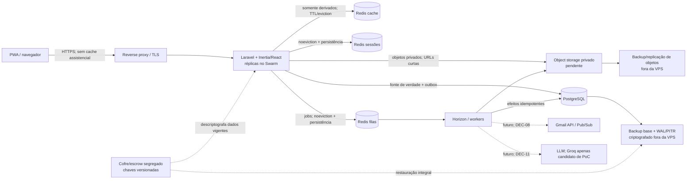

# Arquitetura-alvo do Centro de Acolhimento

- Status: direção aprovada; infraestrutura não implementada
- Data: 28/08/2026
- Tarefas: `DEC-05`, `DEC-06`, `DEC-07`, `IAM-03`, `SEG-02`, `SEG-03`, `DOC-04`, `ARQ-01`, `ARQ-02`, `ARQ-03`, `ARQ-04`, `ARQ-07`, `ARQ-08`
- Decisões: [ADR 0002 — identidade](../adr/0002-identidade-laravel-fortify-totp.md), [ADR 0003 — infraestrutura](../adr/0003-infraestrutura-contabo-swarm-redis.md) e [ADR 0004 — organização e unidade únicas](../adr/0004-organizacao-e-unidade-unicas.md)

## Visão geral

As três caixas Redis são obrigatoriamente serviços/processos e volumes distintos, com políticas diferentes; bancos lógicos da mesma instância não isolam eviction, persistência ou falha. PostgreSQL, Redis e aplicação inicialmente compartilham uma única VPS, portanto o desenho não oferece alta disponibilidade de host.

## Estado atual

- POC monolítica Laravel 13 + Inertia 2 + React 18.
- SQLite copiado para armazenamento efêmero no deploy atual.
- Fotos/documentos em filesystem local/público.
- Autenticação local sem a decisão de Fortify/TOTP implementada.
- Sem Redis, Horizon, Swarm, PostgreSQL de produção, storage privado ou backup/PITR fora da VPS comprovados.
- Dados reais permanecem proibidos até os gates P0, inclusive capacidade/continuidade e restore integral de `ARQ-07`, e go-live formal.

## Contexto organizacional e unidade única

Cada implantação atende uma única organização de acolhimento institucional e uma única unidade operacional/local/complexo físico; não há SaaS multi-organização nem suporte multiunidade nesta fase. Dentro desse complexo existem várias casas para moradia e cuidado cotidiano de crianças e adolescentes. Casa é uma localização interna da unidade única, não uma unidade operacional, organização ou tenant. Se alocação e transferência entre casas exigirão histórico estruturado é uma pendência de `DEC-01`, portanto a arquitetura ainda não fixa sua tabela ou cardinalidade.

O contexto operacional inclui equipe de cuidado cotidiano, equipe técnica e pessoal jurídico/administrativo. Todas as contas técnicas ativas compartilham o mesmo conjunto assistencial aprovado; essa decisão não se estende automaticamente aos demais papéis. A organização precisa elaborar e rastrear exatamente PIA, Relatório de visita técnica, Parecer do acolhido, Ficha de ingresso e Termo de Recebimento/Entrega de documentos e pertences pessoais; efeitos e prazos jurídicos permanecem sujeitos a revisão humana.

Pessoa pertence à organização, enquanto cada episódio de acolhimento e cada usuário pertencem à unidade única. Organização e unidade permanecem entidades/chaves explícitas mínimas para contexto, auditoria, numeração e evolução segura, sem vínculo M:N usuário–unidade, seleção ou filtro de unidade.

O backend resolve o contexto fixo da implantação e não aceita organização/unidade informada pelo cliente como autoridade. Policies distinguem equipe técnica ativa dos demais papéis e mantêm ações administrativas/auditoria separadas. A implementação seguirá migração aditiva e roll-forward: criar organização e unidade por configuração controlada, mapear registros e usuários, validar órfãos e aplicar constraints obrigatórias somente após backfill. Documentos numerados mantêm sequência única por tipo/unidade/ano quando o dicionário aprovado exigir.

Uma futura segunda unidade ou organização exige reabrir a decisão e implementar isolamento, vínculos, autorização, migração e testes antes de ativá-la; a arquitetura atual não deve ser apresentada como preparada para multiunidade. O contrato completo está no [ADR 0004](../adr/0004-organizacao-e-unidade-unicas.md), e nada disso está implementado ainda.

## Fase 1 — base segura dentro do orçamento

A hospedagem futura usa uma Contabo VPS e Docker Swarm single-node. Swarm declara e reinicia serviços, distribui secrets e permite rolling update; não protege contra perda da VPS, disco, rede ou região. PostgreSQL e Redis têm placement constraint/label vinculada ao nó e volume corretos; o Swarm não pode reagendá-los para volume local vazio.

O monólito continua modular. PostgreSQL autogerido inicia na mesma VPS por restrição do orçamento total aproximado de R$ 60/mês, em rede privada, TLS e volume persistente. A aplicação usa role não-superuser; migration e backup/restore têm roles separadas e mínimas. Conexões/timeouts, autovacuum/`ANALYZE`, `pg_stat_statements` restrito, patching e manutenção são definidos antes do go-live; PgBouncer só entra após medição.

Backup base + WAL/PITR criptografado sai obrigatoriamente da VPS e passa por restore test. Um cofre/escrow criptografado e segregado mantém versões de `APP_KEY` e chaves/segredos necessários de backup, OAuth, push e TOTP; unlock key de eventual backup do manager fica separada do artefato. Object storage privado é obrigação ainda pendente; centralizar a execução não permite objeto apenas no disco local ou cópia única.

Laravel Fortify e TOTP obrigatório para toda conta humana são a identidade-alvo. Conta nasce `pendente_mfa` e só acessa enrolamento/confirmar/logout até tornar-se `ativa`; esse é um estado durável da conta. Separadamente, uma conta `ativa` pós-senha fica em sessão transitória `password_only`, limitada a challenge/logout, sem recurso, QR, recovery, re-enrollment ou admin. TOTP válido rotaciona o session ID e cria `mfa_verified`.

Remember-me/recaller fica integralmente desativado na fase inicial: novo login sempre exige senha + TOTP, salvo recovery code de uso único no fluxo explícito de contingência, e cookie recaller não cria nenhum nível de sessão. O cookie autenticado dura somente a sessão do navegador; challenge expira em 5 minutos, inatividade em 15 minutos e duração absoluta em 8 horas.

QR/segredo são negados após confirmação, auto-desativação é bloqueada e recovery codes exigem extensão transacional individualmente hasheada. Gerações TOTP são versionadas/serializadas: apenas a corrente confirma; QR velho falha; re-enrollment preserva o fator atual até cutover atômico e revoga sessões anteriores. Redis é obrigatório em processos/volumes separados para cache, sessões e filas. Laravel Queues + Horizon executam trabalho assíncrono com outbox/idempotência PostgreSQL.

Para conta ativa, QR de re-enrollment, geração/regeneração de recovery codes, remoção e re-enrollment exigem step-up feito há no máximo 5 minutos com senha + fator corrente; `mfa_verified` antigo não basta. Primeiro enrolamento usa senha recém-validada mais confirmação do novo fator, e recuperação administrada usa sua regra reforçada quando o fator corrente foi perdido. Logout global, inativação, reset, recovery, cutover de re-enrollment e perda de dispositivo revogam sessões/tokens em todos os dispositivos.

## Fase 2 — expansão por gatilho

Adicionar nós em domínios de falha distintos, separar aplicação/workers, mover PostgreSQL/Redis para nó dedicado ou serviço gerenciado e ampliar redundância de objetos/backups somente quando uma condição mensurável de `ARQ-08` ocorrer: falha de SLO/RPO/RTO, saturação sustentada, atraso de fila, crescimento de dados/arquivos, manutenção sem janela aceitável, segunda aplicação/organização ou risco incompatível com single-node. Antes de adicionar nós, definir/provar binding, migração e failover de volumes stateful; rescheduling para disco vazio é proibido.

OIDC/Keycloak também só volta à decisão diante de segunda aplicação/SSO, múltiplas organizações/diretório corporativo ou custo operacional menor comprovado. LLM continua pendente de `DEC-11`; Groq é apenas candidato de PoC sintética e não está autorizado a receber dados.

## Responsabilidades dos serviços

| Serviço | Responsabilidade | Não deve fazer |
|---|---|---|
| Reverse proxy/TLS | Terminar HTTPS, headers e encaminhar apenas tráfego esperado | Expor PostgreSQL/Redis ou registrar payload sensível |
| Laravel | Autenticação por nível (`password_only`/`mfa_verified`), step-up recente, Policies, validação, domínio, transações e respostas minimizadas | Aceitar pós-senha/recaller como MFA, step-up antigo, frontend como autorização ou arquivo privado público |
| PostgreSQL | Fonte de verdade, constraints, fatos append-only, auditoria e outbox; roles app/migration/backup separadas | Executar aplicação como superuser, dar DDL rotineiro à app ou depender do cache |
| Redis cache | Acelerar somente leitura derivada e medida | Guardar única cópia, PII desnecessária ou usar TTL infinito |
| Redis sessões | Compartilhar sessão revogável em processo/volume dedicado | Compartilhar instância com cache ou restaurar sessão antiga/revogada |
| Redis filas | Transportar jobs persistentes para Horizon em processo/volume dedicado | Ser única evidência do efeito ou usar Redis Cluster com Horizon |
| Horizon/workers | Retry/backoff, trabalho pesado e integração idempotente; dashboard sob Gate/Policy | Expor dashboard, payload/failed job sensível ou executar efeito sem revalidar contexto |
| Object storage | Objetos privados criptografados, versionados e recuperáveis | URL permanente, nome com PII ou única cópia na VPS |
| Backup fora da VPS | Recuperar PostgreSQL/PITR e objetos dentro de RPO/RTO | Compartilhar credenciais/domínio de falha com a origem |
| Cofre/escrow segregado | Preservar versões necessárias de chaves/segredos e unlock key separada | Versionar segredos no repositório ou guardar chave junto do artefato protegido |

## Classificação de dados e cache

| Classe | Exemplos | Fonte/durabilidade | Cache permitido |
|---|---|---|---|
| Sensível/restrito | Saúde, documentos, fotos, família, localização | PostgreSQL e object storage privado; backups criptografados | Não por padrão; somente derivado minimizado, TTL curto e justificativa medida |
| Eventos e auditoria | Movimentações, finalizações, acessos e alterações | PostgreSQL append-only + backup/PITR | Nunca como única cópia |
| Sessão/autenticação | Conta `pendente_mfa`/`ativa`, sessão `password_only`/`mfa_verified`, step-up e revogação | Redis sessões dedicado + geração de revogação no PostgreSQL; sem recaller; cookie de browser-session, challenge 5 min, idle 15 min e absoluto 8 h | `password_only`/recaller não acessa recursos; step-up antigo não opera MFA; restore invalida/revalida |
| Trabalho assíncrono | IDs opacos de job, tipo/versão, tentativas e atrasos | Redis filas dedicado; intenção/efeito na outbox PostgreSQL | Sem corpo de e-mail/documento, narrativa, PII, URL assinada ou segredo |
| Público/imutável | Assets versionados do frontend | Imagem/CDN ou build | Cache longo por hash, sem dados assistenciais |

Há somente quatro usuários. Desempenho não justifica cache amplo: primeiro medir query, payload e índice; depois cachear seletivamente dados derivados com chave por escopo/autorização e invalidação segura.

## Filas e consistência

Uma transação grava o fato e a outbox no PostgreSQL. O publicador/worker envia ou processa o job com chave natural/idempotência. O efeito externo confirmado é registrado e retries convergem sem duplicação. Falha antes do commit não cria intenção; falha após commit é recuperada pela outbox. Failed jobs, atraso, tentativas e idade da outbox geram métricas sem conteúdo sensível.

Filas previstas: PDFs/exports, miniaturas e antimalware; Gmail/Pub/Sub após `DEC-08`; notificações; e eventual extração após `DEC-11`. Jobs revalidam autorização e estado da conta/recurso antes de entregar dados ou notificar. Persistência/fsync, backup/restore e alertas do Redis de filas/sessões seguem RPO definido; restore de fila reconcilia com outbox.

O [Laravel Horizon 13.x](https://laravel.com/docs/13.x/horizon) não suporta Redis Cluster. A fila permanece em Redis não-cluster dedicado nesta fase; antes de adotar Cluster, uma ADR precisa optar por manter esse serviço compatível ou substituir Horizon/driver por alternativa testada.

`/horizon` exige Gate/Policy backend, conta ativa, sessão `mfa_verified` e permissão operacional; reverse proxy/rede administrativa ou VPN é barreira adicional recomendada. Visitante, usuário comum, `password_only` e vínculo inadequado são negados em testes diretos. Payloads usam IDs opacos e metadados mínimos; trim/retenção de recentes/concluídos/failed jobs, sanitização de exceções/tags/logs e acesso Redis por rede/credencial de serviço impedem que a fila vire repositório paralelo de dados sensíveis.

## Modos de falha

| Falha | Impacto esperado na fase 1 | Controle/recuperação |
|---|---|---|
| VPS ou nó único indisponível | Aplicação, banco, Redis e workers indisponíveis | Recriar host/stack; recuperar chaves do cofre; restaurar PG por base + WAL; reconciliar objetos/outbox; RTO testado |
| PostgreSQL indisponível | Mutação e leitura autoritativa falham fechado | Não servir cache como verdade; alertar e recuperar serviço/volume |
| Redis cache perdido | Degradação temporária | Descartar e reaquecer; nenhuma perda assistencial |
| Redis sessões perdido | Sessões podem ser encerradas | Invalidar ou validar geração/revogação no PG; exigir reautenticação/TOTP; nunca aceitar sessão antiga/revogada do backup |
| Redis filas/worker parado | Trabalho atrasa | Persistência/fsync, volume/backup dedicado, Horizon, alerta, failed jobs e outbox para reconciliação |
| Horizon exposto ou job sensível | Metadado/payload pode vazar | Gate/Policy + rede admin, sessão MFA, IDs opacos, trim/retenção, logs/failed jobs redigidos e teste negativo |
| Object storage indisponível | Upload/download falha ou fica pendente | Estado de quarentena/pendência; retry idempotente; nunca alegar sucesso parcial |
| Backup fora da VPS falha | RPO/RTO ameaçados | Alerta bloqueante, corrigir e repetir backup/restore antes de go-live |
| Gmail/LLM futuro falha | Integração suspensa | Core permanece funcional; retry/circuit breaker e revisão humana; nenhum efeito automático |

## Segurança e LGPD

- HTTPS obrigatório; rede privada para banco/Redis; portas administrativas restritas.
- Docker secrets e segregação por ambiente; rotação e inventário, sem segredo em repositório ou log. Versões necessárias à restauração ficam em cofre/escrow criptografado fora da VPS; unlock key do manager fica separada de seu backup.
- Role PostgreSQL da aplicação sem superuser/DDL; roles de migration e backup mínimas, separadas e auditadas. `pg_stat_statements` e métricas não recebem parâmetros/payload sensível.
- Policies e escopo no backend para cada leitura/mutação/download; testes negativos de IDOR.
- Organização/unidade são contexto fixo do backend em consultas, mutações, arquivos e auditoria; parâmetros do cliente não podem escolher nem trocar esse contexto.
- Sessão `password_only` tem timeout/rate limit, não emite remember-me e só acessa challenge/logout; conclusão MFA rotaciona o ID. Conta `pendente_mfa` só acessa enrolamento/confirmar/logout.
- Recaller é desativado antes/depois de MFA. Cookie de browser-session, idle de 15 minutos e absoluto de 8 horas são impostos no servidor; cookie recaller fabricado/antigo/roubado/revogado não autentica nem cria sessão.
- Operações MFA exigem step-up de senha + fator corrente nos últimos 5 minutos; primeiro enrolamento e recuperação administrada são as únicas exceções explícitas. Eventos globais de segurança revogam todos os dispositivos.
- Conceder/remover papel também exige step-up de senha + TOTP nos últimos 5 minutos, alvo terceiro e papel em allowlist fechada. Autopromoção, papel fora da allowlist e sessão sem step-up falham fechado, geram alerta/auditoria e não deixam alteração parcial. A primeira administradora nasce por bootstrap operacional único, atribuível e auditado fora do fluxo comum, nunca por cadastro público, seed com credencial ou conta compartilhada.
- Dados em trânsito e repouso criptografados; backup fora da VPS com credenciais separadas e restore integral testado, inclusive chaves necessárias e ausência de ressurreição de sessões.
- Logs/traces minimizados, sem senha, token, TOTP, CPF, CNS, narrativa clínica, arquivo ou URL assinada.
- Jobs/failed jobs usam IDs opacos e metadados mínimos; Horizon/Redis não armazenam corpo de e-mail, documento, narrativa assistencial, PII ou segredo, e `/horizon` exige autorização backend/rede administrativa.
- Arquivos privados usam nome aleatório sem PII, quarentena, validação, antimalware e URL curta auditada.
- Auditoria append-only registra ator, alvo, ação, resultado e horário UTC sem copiar o conteúdo sensível.
- Retenção, descarte, legal hold, fornecedor/região/DPA e RPO/RTO finais dependem das aprovações `LGPD-01/02/03`, `SEG-07` e `OPS-02`.

## Fluxo de deploy

1. CI instala pelos lockfiles e executa gates de formato, testes, build e auditoria.
2. Construir uma imagem imutável, sem credenciais nem dados.
3. Validar migration aditiva e compatibilidade da versão anterior; banco usa roll-forward, nunca `migrate:fresh`.
4. Publicar imagem e atualizar stack no Swarm com Docker secrets, healthcheck, limites de recursos e placement/volume binding explícitos para stateful.
5. Executar migrations uma única vez com role separada sob controle e então rolling update de aplicação/workers.
6. Rodar smoke/readiness e observar erro, fila, outbox, banco, Redis e backup sem payload sensível.
7. Em falha, voltar à imagem compatível anterior; preservar schema/dados e corrigir adiante. Reversão destrutiva de migration não faz parte do fluxo.

## Decisões e status

| Item | Status | Referência/condição |
|---|---|---|
| Monólito modular Laravel/Inertia/React | Aprovado; já é direção do código | `ARQ-05` |
| Uma organização cliente e uma unidade operacional por implantação | Aprovado; não implementado | `DEC-05`, ADR 0004; papéis/setores em `SEG-02` |
| Fortify + TOTP para toda conta humana; passkeys desativadas | Aprovado; não implementado | `DEC-07`, `IAM-02`, ADR 0002 |
| Contabo VPS + Swarm single-node | Aprovado como alvo; não implantado | `ARQ-03`, ADR 0003 |
| PostgreSQL autogerido na VPS, roles separadas | Aprovado para fase 1; não implantado | `ARQ-01`; saída por SLO/RPO/RTO/capacidade |
| Três processos/volumes Redis | Aprovado; não implantado | `ARQ-04`; bancos lógicos não atendem; sessões/filas `noeviction` |
| Laravel Queues + Horizon sem Redis Cluster | Aprovado; não implantado | `ARQ-04`; saída obrigatória antes de Cluster |
| Object storage privado | Obrigatório e pendente de fornecedor | `ARQ-02`, `SEG-07` |
| Backup PG WAL/PITR, objetos e cofre de chaves fora da VPS | Obrigatório; não implementado/testado | `ARQ-01`, `ARQ-07`, `OPS-02` |
| Capacidade/SLO/RPO/RTO/restore mínimo | Gate P0; não aprovado | `ARQ-07`; bloqueia dados reais |
| Crescimento e otimização | Pendente P2 | `ARQ-08` |
| Gmail/Pub/Sub | Pendente | `DEC-08`, `EML-01/02/03` |
| LLM / Groq | Pendente; Groq apenas candidato de PoC | `DEC-11`; proibido para dados reais |
| Alta disponibilidade | Não entregue na fase 1 | Exige múltiplos domínios de falha e testes |

## Premissas de capacidade

- Quatro usuários nomeados inicialmente, uma única aplicação e nenhuma demanda de SSO por dois anos.
- Orçamento total aproximado de R$ 60/mês; `ARQ-07` precisa aprovar antes de dados reais o dimensionamento mínimo da VPS, conexões/disco, SLO, RPO/RTO, alertas e restore integral.
- Concorrência observada, crescimento, massa de carga e otimizações são medidos depois em `ARQ-08`, sem enfraquecer o gate P0 anterior.
- A primeira otimização é consulta paginada, índices PostgreSQL, payload mínimo e trabalho em fila. Cache amplo ou réplica adicional no mesmo host não substituem capacidade comprovada nem HA.
